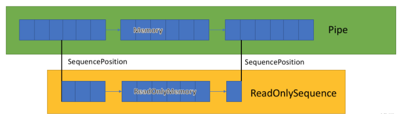

>已发布Nuget:https://www.nuget.org/packages/EasyTcp4Net/
或包管理器搜索"EasyTcp4Net"  ！！！！！！！！！！！！！！！！！！！！！！！

> 这是一个基于c# Pipe,ReadonlySequence的高性能Tcp通信库，旨在提供稳定，高效，可靠的tcp通讯服务。

- [x] 基础的消息通讯
- [x] 重试机制
- [x] 超时机制
- [x] SSL加密通信支持
- [x] KeepAlive
- [x] 流量背压控制
- [x] 粘包和断包处理 （支持固定头处理，固定长度处理，固定字符处理）
- [x] 日志支持
 
### Pipe & ReadOnlySequence


#### 为什么选择 Pipe & ReadOnlySequence
**TCP** 是一个流式面向连接的传输协议，所以源源不断地处理数据，并且在合适的地方进行数据分包，才是我们所关心的。Pipe本身是流水线一样的处理管道，我们只需要把我们收到的数据源源不断地扔到管道里，管道的消费端会帮我们进行数据处理


**ReadOnlySequence** 是多组数据的链表结构，更加符合了Tcp的流式传输的特征，并且它强大的多组数据切割能力，可以让我们非常方便的在多数据包中获取正确的数据。

**Link:**


https://learn.microsoft.com/zh-cn/dotnet/api/system.buffers.readonlysequence-1?view=net-7.0
https://learn.microsoft.com/zh-cn/dotnet/api/system.io.pipes?view=net-8.0

### 客户端配置（EasyTcpClientOptions）

| Key         | Description |
| ----------- | ----------- |
| NoDelay      | 是否不使用 Nagle's算法    避免了过多的小报文的过大TCP头所浪费的带宽   |
| BufferSize   | 流数据缓冲区大小        |
| ConnectTimeout   | 连接超时时间        |
| ConnectRetryTimes   | 连接失败尝试次数        |
| ReadTimeout   | 从socket缓冲区读取数据的超时时间        |
| WriteTimeout   | 向socket缓冲区写入数据的超时时间        |
| IsSsl   | 是否使用ssl连接        |
| PfxCertFilename   | ssl证书        |
| PfxPassword   | ssl证书密钥        |
| AllowingUntrustedSSLCertificate   | 是否允许不受信任的ssl证书        |
| LoggerFactory   | 日志工厂        |
| KeepAlive   | 是否启动操作系统的tcp keepalive机制        |
| KeepAliveTime   | KeepAlive的空闲时长，或者说每次正常发送心跳的周期，默认值为3600s（1小时）       |
| KeepAliveProbes   | KeepAlive之后设置最大允许发送保活探测包的次数，到达此次数后直接放弃尝试，并关闭连接        |
| KeepAliveIntvl   | 没有接收到对方确认，继续发送KeepAlive的发送频率，默认值为60s        |
| MaxPipeBufferSize   | 待处理数据队列最大缓存,如果有粘包断包的过滤器，要大于单个包的大小，防止卡死        |

### 服务端配置（EasyTcpServerOptions）

| Key         | Description |
| ----------- | ----------- |
| NoDelay      | 是否不使用 Nagle's算法    避免了过多的小报文的过大TCP头所浪费的带宽   |
| BufferSize   | 流数据缓冲区大小        |
| ConnectionsLimit   | 最大连接数        |
| BacklogCount   | 连接等待/挂起连接数量        |
| IsSsl   | 是否使用ssl连接        |
| PfxCertFilename   | ssl证书        |
| PfxPassword   | ssl证书密钥        |
| AllowingUntrustedSSLCertificate   | 是否允许不受信任的ssl证书        |
| MutuallyAuthenticate   | 是否双向的ssl验证,标识了客户端是否需要提供证书        |
| CheckCertificateRevocation   | 是否检查整数的吊销列表        |
| LoggerFactory   | 日志工厂        |
| IdleSessionsCheck   | 是否开启空闲连接检查        |
| CheckSessionsIdleMs   | 空闲连接检查时间阈值        |
| KeepAlive   | 是否启动操作系统的tcp keepalive机制        |
| KeepAliveTime   | KeepAlive的空闲时长，或者说每次正常发送心跳的周期，默认值为3600s（1小时）       |
| KeepAliveProbes   | KeepAlive之后设置最大允许发送保活探测包的次数，到达此次数后直接放弃尝试，并关闭连接        |
| KeepAliveIntvl   | 没有接收到对方确认，继续发送KeepAlive的发送频率，默认值为60s        |
| MaxPipeBufferSize   | 待处理数据队列最大缓存,如果有粘包断包的过滤器，要大于单个包的大小，防止卡死        |

#### 开启一个Server
```
EasyTcpServer _server = new EasyTcpServer(_serverPort);
_server.StartListen();
```
#### 开启一个Server并且配置SSL证书
```
EasyTcpServer easyTcpServer = new EasyTcpServer(7001, new EasyTcpServerOptions()
{
    IsSsl = true,
    PfxCertFilename = "xxx",
    PfxPassword = "xxx",
    IdleSessionsCheck = false,
    KeepAlive = true,
    CheckSessionsIdleMs = 10 * 1000
});
```
#### 开启一个Server，配置数据过滤器处理粘包断包
#### 固定头处理
```
//参数分别为：数据包头长度，数据包体长度所在头下标，数据包体长度字节数，是否小端在前
easyTcpServer.SetReceiveFilter(new FixedHeaderPackageFilter(7, 5, 4, true));
```
#### 固定长度处理
```
//参数分别为：数据包固定长度
easyTcpServer.SetReceiveFilter(new FixedLengthPackageFilter(50));
```
#### 固定字符处理（不推荐）
```
//参数分别为：截取的字符
easyTcpServer.SetReceiveFilter(new FixedCharPackageFilter('\n'));
```

#### 客户端收到数据的回调
```
easyTcpClient.OnReceivedData += (obj, e) =>
{
    Console.WriteLine(string.Join(',', e.Data));
    Console.WriteLine("\n");
};
```


#### 服务端收到数据的回调
```
easyTcpServer.OnReceivedData += async (obj, e) =>
{
    Console.WriteLine($"数据来自：{e.Session.RemoteEndPoint}");
    Console.WriteLine(string.Join(',', e.Data));
};
```
#### 日志配置

```
var _server = new EasyTcpServer(_serverPort, new EasyTcpServerOptions()
{
    ConnectionsLimit = 2,
    LoggerFactory = LoggerFactory.Create(options => 
    {
        Log.Logger = new LoggerConfiguration()
        .MinimumLevel.Information()//最小的记录等级
        .MinimumLevel.Override("Microsoft", LogEventLevel.Information)//对其他日志进行重写,除此之外,目前框架只有微软自带的日志组件
        .WriteTo.Console()//输出到控制台
        .CreateLogger();

        options.AddSerilog();
    })
});
```